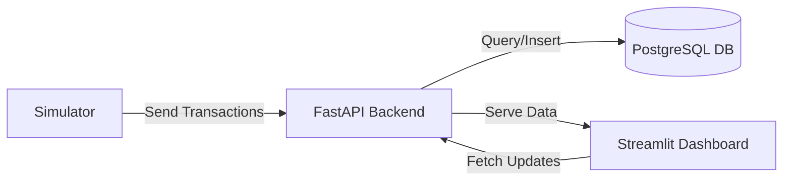

[](https://www.python.org)
[](https://fastapi.tiangolo.com)
[](https://streamlit.io)
[](https://www.postgresql.org)
[](LICENSE)

#  Retail Analytics Platform

A **production-style retail data pipeline and analytics system** that replaces manual spreadsheet reporting with a **real-time, queryable, and scalable workflow**.

This platform simulates transaction data, processes it through a validated API, stores it in a normalized PostgreSQL database, and visualizes business KPIs via an interactive dashboard.

---

##  Key Highlights

- 📊 Real-time KPI tracking (Revenue, Orders, AOV)
- ⚡ Async backend with high-performance DB access
- 🔄 Live transaction ingestion pipeline
- 📈 Interactive Streamlit dashboard
- 🧱 Fully normalized relational schema
- 🐳 Containerized PostgreSQL setup

---

##  Architecture



## Tech Stack

| Layer           | Technology        | Role                                                      |
| --------------- | ----------------- | --------------------------------------------------------- |
| Database        | PostgreSQL 15     | Relational storage with constraints and optimized queries |
| Backend         | FastAPI + asyncpg | Async API layer with connection pooling                   |
| Data Generation | Faker             | Synthetic data generation for simulation                  |
| Connector       | psycopg2-binary   | DB operations and schema execution                        |
| Frontend        | Streamlit         | Interactive analytics dashboard                           |


## Features
### Data & Backend
Normalized 4-table schema with UUID primary keys
Foreign key constraints with cascading deletes
Transaction-safe inserts (no partial writes)

### API Layer
Built with FastAPI
Pydantic validation for request/response models
Auto-generated Swagger docs (/docs)

### Live Ingestion
Simulates real-world webhook pipeline
Handles retries with exponential backoff
Maintains referential integrity

### Dashboard
Real-time KPI visualization
Date filtering + auto-refresh
Clean UI with custom theming 

### Infrastructure
Dockerized PostgreSQL instance
Persistent volumes + health checks

## Quick Start
Prerequisites
Python 3.10+
Docker Desktop
Git

## Setup
Clone repository

git clone https://github.com/Nirrmitt/retail-analytics-platform.git
cd retail-analytics-platform

### Create virtual environment
python -m venv venv
venv\Scripts\activate   :Windows
source venv/bin/activate  :macOS/Linux

### Install dependencies
pip install -r requirements.txt

### Start database
docker compose up -d

### Initialize schema & seed data
python database/force_create_tables.py
python database/seed_data.py

### Run Services

### Open 3 terminals:

1️⃣ API Server
$env:PYTHONPATH="."
uvicorn src.api.main:app --reload --port 8000

2️⃣ Dashboard
streamlit run src/dashboard/app.py

3️⃣ Live Simulator
python scripts/live_simulator.py

🌐 Access Points
Dashboard → http://localhost:8501
API Docs → http://localhost:8000/docs
Health Check → http://localhost:8000/health

## Project Structure
```bash

├── database/               # Schema & seed scripts
├── scripts/                # Data simulator
├── src/
│   ├── api/                # FastAPI backend
│   ├── dashboard/          # Streamlit UI
│   └── config/             # App configuration
├── .streamlit/             # UI theme config
├── docker-compose.yml      # DB container
├── requirements.txt
└── README.md
```

## API Endpoints

| Method | Endpoint                       | Description                                     |
| ------ | ------------------------------ | ----------------------------------------------- |
| GET    | /health                        | Checks database connectivity and service health |
| GET    | /api/v1/kpi/revenue            | Revenue, order count, AOV (configurable)        |
| GET    | /api/v1/sales/daily-revenue    | Time-series revenue trends                      |
| GET    | /api/v1/sales/category-revenue | Revenue breakdown by category                   |
| POST   | /api/v1/data/ingest            | Validated transaction ingestion                 |

📌 All endpoints return JSON. Swagger UI available at /docs.

## Data Pipeline

### The simulator mimics a real-world ingestion system:

Fetches valid customer_id and product_id
Generates realistic transactions (1–3 items)
Sends POST requests to ingestion API
Uses retry logic with exponential backoff
Logs pipeline activity for monitoring

## Development Notes
 Windows users: Set PYTHONPATH="." to avoid import issues
 Streamlit uses st.rerun() for live updates
 Change ports if conflicts occur (8000 / 5433)
 SQL execution handled via Python to avoid encoding issues
 Production Considerations

## To scale this system:

Replace simulator with Kafka / RabbitMQ
Add Redis caching for KPI endpoints
Implement JWT authentication
Use Docker/Kubernetes for deployment
Manage secrets via environment variables


## 🤝 Connect & Contribute
I’m always open to feedback, collaboration, or chat about analytics engineering, automation, or data storytelling.
📧 Email: nirrmit.rtickoo@gmail.com
🌐 Portfolio: [NRT](https://nirrmitt.github.io/NRT-Terminal)
💼 LinkedIn: [Nirrmit R. Tickoo](https://www.linkedin.com/in/n-r-t/)
🐙 GitHub: [ @nirrmitt](https://github.com/Nirrmitt)
🔧 Found a bug or have an idea? Open an issue or submit a PR. I review all contributions!

### 📜 License
MIT ©[Nirrmitt](https://nirrmitt.github.io/NRT-Terminal) Feel free to use, adapt, and build upon this for your own projects or learning journey.
